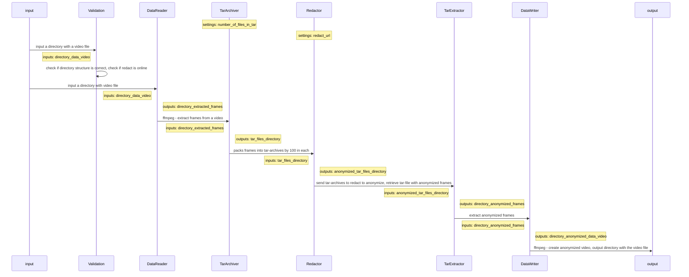

# MP4 data converter

## Overview
For a better understanding of the development principles, we created this sample pipeline as a reference, which consists of following elements:

- Validator - making sure that there is a input video
- Data Reader - splitting the video into frames
- Tar Archiver - packing frames into tar-archives
- Redactor - anonymizing packed in archives frames using Redact
- Tar Extractor - extracting anonymized frames from the archives
- Data Writer - creating anonymized video from anonymized frames

This example pipeline could be illustrated as follows:

or as picture:

  

We also created a helper classes to perform operations on data using FFMPEG and tarfile python module - [FFMPEG Executor](utils/ffmpeg_executor.py) (for Data Reader and Data Writer) and [Tar Executor](utils/tar_executor.py) (for Tar Archiver and Tar Extractor).

## Developer guide

If the pipeline structure needs to be changed, or new pipeline elements are needed, please refer to [our developer guide](../../README.md#developer-guide).

## Code Style Reference
A "Best of the Best Practices" [(BOBP) guide to developing in Python](https://gist.github.com/sloria/7001839).
### Formatting
Use [`format.sh`](../../scripts/format.sh)  to format and check the code for PEP8 compliance

### Type annotations
We use type annotation for most of our code. 
> **_NOTE:_** We do NOT use `Generics` and `parameterized generics` in annotations.
> We use classical syntax. 
For `numpy` arrays type annotations, please see [numpy.typing](https://numpy.org/devdocs/reference/typing.html)

| do this                            | do NOT do this                     |
|:-----------------------------------|:-----------------------------------|
| `Dict[str, int]`                   | `dict[str, int]`                   |
| `Tuple[List[Dict[str, int]], ...]` | `tuple[list[dict[str, int]], ...]` |
| `npt.NDArray[np.uint8]`            | `np.ndarray`                       |
